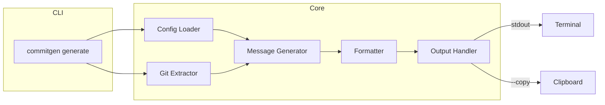

# Commit Message 自动生成 CLI 工具 - MVP 实现计划

## 项目现状

工作区为空，需从零搭建 TypeScript CLI 项目。

---

## 技术选型


| 模块     | 选型         | 说明                                 |
| ------ | ---------- | ---------------------------------- |
| CLI 框架 | commander  | 成熟稳定，支持子命令与参数                      |
| 打包     | esbuild    | 比 pkg 更轻量，单文件输出快                   |
| 测试     | Vitest     | 与 Vite 生态一致，支持 ESM                 |
| 剪贴板    | clipboardy | 跨平台 clipboard 支持                   |
| 日志     | 自实现        | 支持 debug/info/error，`--verbose` 控制 |


---

## 目录结构

```
src/
  cli/
    index.ts           # CLI 入口，commander 配置
    commands/
      generate.ts      # commitgen generate 命令
  core/
    git/
      extractor.ts     # GitContext 提取
      types.ts
    generator/
      types.ts
      local-adapter.ts # 模板/mock 实现
      remote-adapter.ts
      factory.ts       # 根据 --model 选择 adapter
    formatter/
      types.ts
      conventional.ts
      factory.ts
    output/
      types.ts
      stdout-handler.ts
      clipboard-handler.ts
    config/
      loader.ts        # .commitgenrc.json + package.json.commitgen
      types.ts
  utils/
    logger.ts
```

---

## 核心实现要点

### 1. CLI 入口 (`src/cli/index.ts`)

- 使用 commander 注册 `commitgen generate`
- 参数：`--model [local|remote]`、`--style [conventional|custom]`、`--copy`、`--verbose`
- 流程：加载配置 → 合并 CLI 参数 → 获取 Git 上下文 → 生成 message → 格式化 → 输出

### 2. Git Context Extractor (`core/git/extractor.ts`)

- 使用 `child_process.execSync` 调用 `git diff --cached`、`git rev-parse --abbrev-ref HEAD`、`git diff --cached --name-only`
- 返回 `{ stagedDiff, branch, files }`，无 staged 时给出友好提示

### 3. Message Generator 策略模式

- **LocalAdapter**：基于 staged diff 关键词（feat/fix/refactor/docs 等）的简单模板，或随机选一个预设模板
- **RemoteAdapter**：预留 HTTP 接口，可配置 baseUrl + apiKey，MVP 可先返回占位或简单 fetch 骨架
- 统一 `MessageGenerator` 接口：`generate(context: GitContext): Promise<string>`

### 4. Formatter

- **ConventionalFormatter**：校验/补全 type(scope): description 格式
- 接口：`format(raw: string, style: string): string`，便于后续扩展 custom 风格

### 5. Config Loader

- 查找顺序：`.commitgenrc.json` → `package.json` 的 `commitgen` 字段
- 配置项：`model`、`style`、`output`（stdout/clipboard/auto）
- MVP 的 `output: auto` 可暂等同于 stdout

### 6. Logger

- 支持 `debug`/`info`/`error`
- 仅当 `--verbose` 或 `config.verbose` 为 true 时输出 debug

### 7. Output Handler

- `StdoutHandler`：`console.log(message)`
- `ClipboardHandler`：使用 clipboardy，`--copy` 时启用
- 可组合：先 stdout，若 `--copy` 再复制到剪贴板

---

## 数据流示意




---

## 工程配置

- **package.json**：`bin: { "commitgen": "dist/cli/index.js" }`，scripts: `build`、`dev`、`test`
- **tsconfig.json**：`module: NodeNext`，`outDir: dist`
- **esbuild**：`build` 脚本打包为单文件 `bin/commitgen`（或 `commitgen.js`）
- **Vitest**：`vitest.config.ts`，测试 `formatter`、`generator`、`git/extractor`、`config/loader`

---

## 实现顺序

1. 初始化项目（package.json、tsconfig、esbuild、vitest）
2. 实现 `utils/logger`、`core/config/loader`
3. 实现 `core/git/extractor`
4. 实现 `core/formatter`（ConventionalFormatter）
5. 实现 `core/generator`（LocalAdapter、RemoteAdapter 骨架）
6. 实现 `core/output`（Stdout、Clipboard）
7. 实现 `cli/commands/generate` 与 CLI 入口
8. 编写单元测试与集成测试
9. 配置 esbuild 单文件打包

---

## 扩展留白（接口层面）

- `MessageGenerator`：后续可接入 llama.cpp、vLLM、OpenAI
- `Formatter`：可注册新风格（如 `custom`）
- `OutputHandler`：可注册 Raycast、CI/CD、auto-commit 等插件
- `GitContext`：可扩展为增量 diff、分块分析

---

## 交付物

- 可执行 `npx commitgen generate` 或 `./bin/commitgen generate`
- 支持 `--model local|remote`、`--style conventional`、`--copy`、`--verbose`
- 支持 `.commitgenrc.json` 配置
- 单元测试覆盖核心模块
- 单文件二进制（esbuild 输出）

